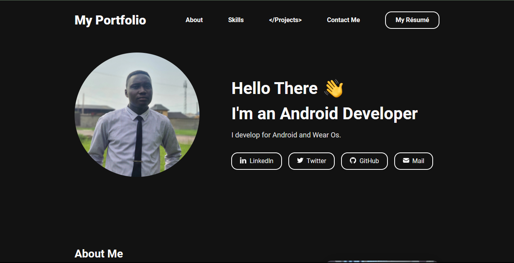

<a href="https://vader-femi.github.io/gatsby-theme-portfolio-minimal/" target="_blank"
rel="nofollow noopener noreferrer" aria-label="Live Demo"><u>Live Demo 🚀</u></a>


# My portfolio.

---

#### The Portfolio was forked from a Gatsby template

<a href="https://github.com/konstantinmuenster/gatsby-starter-portfolio-minimal-theme">Gatsby Template</a>

---

#### The Favicon (Personal Logo) was inspired by vecteezy

<a href="https://www.vecteezy.com/free-vector/f-logo">F Logo Vectors by Vecteezy</a>

---

## Installation

1. Install the Gatsby CLI

   ```sh
   npm install -g gatsby-cli
   ```

2. Create a new Gatsby site with the Portfolio.

   ```sh
   gatsby new portfolio-minimal https://github.com/Vader-Femi/gatsby-theme-portfolio-minimal
   ```

3. Once installed, you can begin developing your site.

   ```sh
   cd portfolio-minimal
   gatsby develop
   ```
---


#### Updating the Resume

- To update the Résumé, update it in both the about.md and settings.json files in content folder.

---
